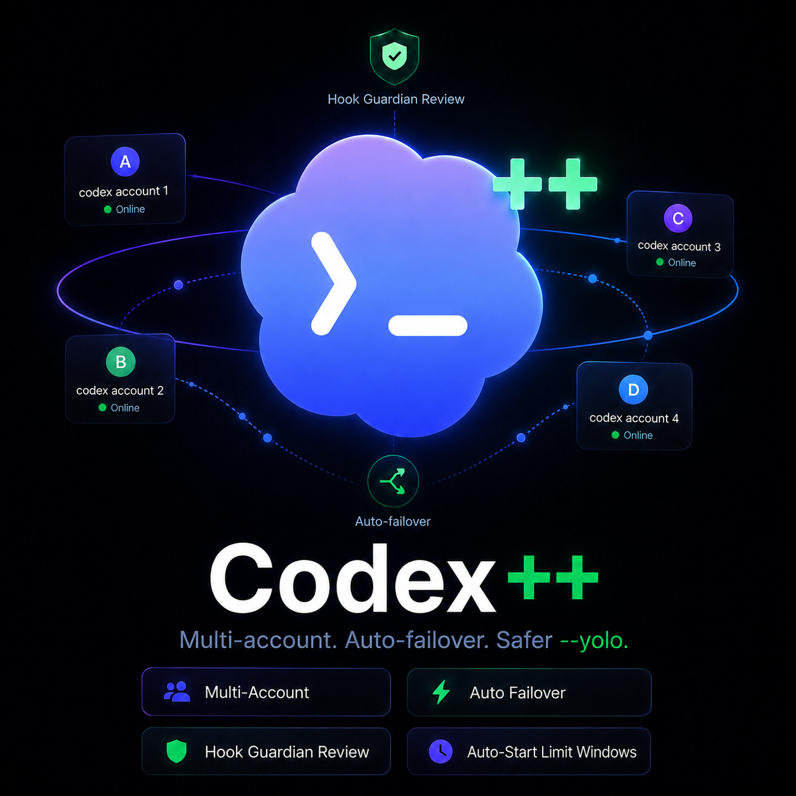

<p align="center">
  
</p>

# Codex++

Codex++ is a lean fork of upstream [OpenAI Codex](https://github.com/openai/codex), focused on multi-account workflows, safer hook-driven automation, and Windows reliability.

## Changes vs Upstream

- Multi-account support
  - Add ChatGPT accounts with `codex account add`.
  - Automatically fail over with no interruption when the active account reaches a usage limit.
  - Use `/accounts` to enable or disable accounts and their automation.
  - Auto-chooses an account on startup, respecting five-hour and weekly usage windows.
  - Avoids accounts already in use by another Codex++ process.
  - Automatically starts usage weekly limits when configured.
- Hook-requested review under `--yolo`
  - Supports `permissionDecision: "ask"` from `PreToolUse` hooks even when Codex runs with `--yolo`.
  - For example, a destructive-command guard can request a Guardian auto-review instead of only allowing or denying the command itself.
- Windows reliability fixes
  - Includes fixes for TUI focus, input, and process behavior on Windows.
  - Provides a subprocess-visible shim so tools such as Review Suite reliably launch Codex++ rather than another Codex installation (and can auto-use the multi-account features)

Codex++ otherwise stays close to upstream. It uses the normal `$CODEX_HOME` for configuration, sessions, plugins, and state, while imported account credentials live under `$CODEX_HOME/accounts`.

## Install a Release

Download the package for your platform and its installer from [Codex++ Releases](https://github.com/Pimpmuckl/codex/releases).

On Windows, extract the package and run:

```powershell
.\install-codex-plus-plus.ps1 -TargetExe .\bin\codex.exe -Install -AddToUserPath
```

On macOS or Linux, extract the package and run:

```sh
sh install-codex-plus-plus.sh --target-exe ./bin/codex --install
```

Both installers copy the package under `$CODEX_HOME/packages/codex-plus-plus`, then switch the shim to the new immutable release. Existing sessions keep running their previous release while new sessions use the new one. The current and immediately previous releases plus any older release still in use are retained; other stale releases are removed automatically.

## Manage Accounts

```sh
codex account add
codex account list
```

Inside the TUI:

- `/accounts` configures accounts and per-account automation.
- `/codexplusplus` configures global fork features.

## Build Locally

Build and install a package using a temporary fork version such as `<upstream-version>-fork`:

```powershell
python scripts/build_codex_plus_plus.py --install
```

Without `--install`, the helper builds the reusable package directory at `dist/codex-plus-plus`. Explicit package arguments after `--` still override that default.

## Remove the Shim

```powershell
.\scripts\install\install-codex-plus-plus.ps1 -Remove
```

```sh
sh scripts/install/install-codex-plus-plus.sh --remove
```

Removing or replacing the shim does not remove the account store under `$CODEX_HOME/accounts`.

Happy Codex-ing.
